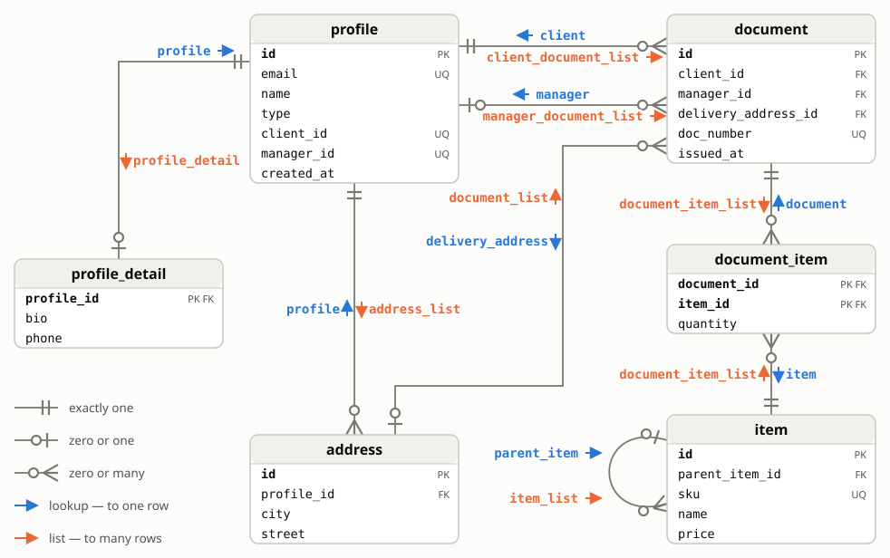

# Example schema

Six tables cover every relation kind the generator handles. Each edge on the diagram carries its generated pair: blue arrow — the lookup, orange arrow — the list.

What the schema exercises:

- **1:1** — `profile_detail.profile_id` is both PK and FK, so the list side collapses to a singular: `profile_detail(profile)`.
- **Plain 1:N** — `address.profile_id`: `profile(address)` / `address_list(profile)`.
- **Two FKs to one table** — `document.client_id` and `document.manager_id` both point at `profile`: lookups split by role (`client(document)`, `manager(document)`), lists get role prefixes (`client_document_list`, `manager_document_list`). `manager_id` is nullable — the optional-relation case.
- **FK to a UNIQUE column, not the PK** — `client_id` / `manager_id` reference generated unique columns of `profile`.
- **Composite FK** — `document (delivery_address_id, client_id)` references `address (id, profile_id)`: `delivery_address(document)` / `document_list(address)`.
- **m:n bridge** — `document_item` links documents and items: two lookups plus `document_item_list(document)` and `document_item_list(item)` — same name, different argument type, plain overloading.
- **Self-reference** — `item.parent_item_id`: `parent_item(item)` / `item_list(item)`.

Files:

- [init.sql](init.sql) — tables and seed data. Load it, run the [generator](../relation_sql.sql), and all 16 relation functions appear.
- [query.sql](query.sql) — 19 side-by-side pairs: classic joins vs relation functions, from simple lookups to recursion, DML and set operations.

No install needed to try it — the same schema with pre-generated functions lives in a [db&lt;&gt;fiddle sandbox](https://dbfiddle.uk/0dTsWUTZ); the [test environment](../test/README.md) adds bulk data for plan comparisons.
